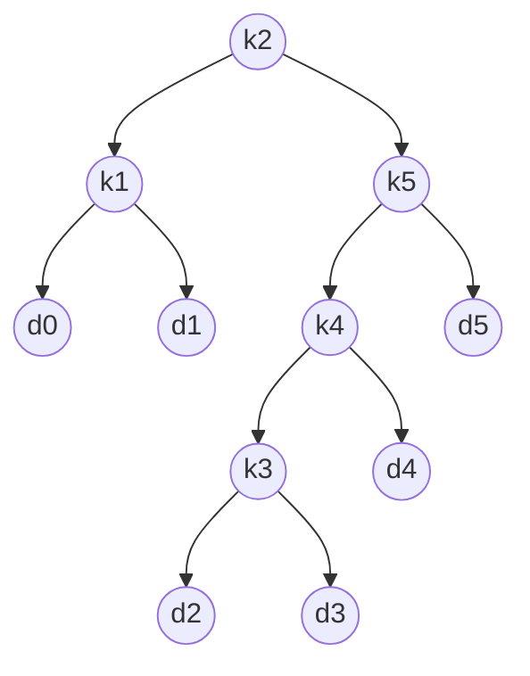

&emsp;&emsp;最优二叉搜索树算法是一种[动态规划算法](/2021/01/26/suan-fa-ji-chu-dong-tai-gui-hua/)。该算法解决的问题是：在给定结点出现频率的前提下，如何组织一颗二叉搜索树，使所有搜索操作访问的结点数最少？这也是一个最优解问题。

<!-- more -->

### 描述

&emsp;&emsp;给定一个n个不同关键字的已排序的序列K，用该序列构建一颗二叉搜索树。对于每个关键字`$k_i$`，都有一个概率`$p_i$`表示其搜索频率。有些要搜索的值可能不在K中，应次还有n+1个伪关键字`$d_0,d_1,\cdots,d_n$`表示不在K中的值。$d_0$表示所有小于`$k_1$`的值，`$d_n$`表示所有大于`$k_n$`的值。对于每一个`$d_i$`,也有一个概率`$q_i$`表示其搜索频率。每次查找要么成功（找到某个关键字），要么失败（找到某个伪关键字）。

$$
\sum\limits_{i=1}^nP_i+\sum\limits_{i=0}^nq_i=1
$$

#### 例子

&emsp;&emsp;一颗n=5的最优二叉树（期望搜索代价为2.75）：

| i     | 0    | 1    | 2    | 3    | 4    | 5    |
|-------|------|------|------|------|------|------|
| $p_i$ |      | 0.15 | 0.10 | 0.05 | 0.10 | 0.20 |
| $q_i$ | 0.05 | 0.10 | 0.05 | 0.05 | 0.05 | 0.10 |



$$
E[T中搜索代价]=1+\sum\limits_{i=1}^ndepth_T(k_i)\cdot p_i+\sum\limits_{i=1}^ndepth_T(d_i)\cdot q_i
$$

### 刻画最优子结构

#### 证明

&emsp;&emsp;如果一颗最优二叉搜索树T有一颗包含关键字`$k_i,\cdots ,k_j$`的子树T‘，则其必然是包含关键字`$k_i,\cdots ,k_j$`和伪关键字`$d_{i-1},\cdots ,d_{j}$`的最优解。如果存在子树T''，其期望搜索代价比T'低。则用T''替换T'，则与T最优的假设矛盾。

&emsp;&emsp;因此我们可以利用最优子结构的性质，检查所有可能的根结点`$k_i$`，对其求解包含`$k_i,\cdots ,k_{r-1}$`及包含`$k_{r+1},\cdots ,k_j$`的最优二叉搜索树，即可找到原问题最优解。

#### 递归算法

&emsp;&emsp;子问题域：求解包含关键字`$k_i,\cdots,k_j$`的最优二叉搜索树。`$e[i,j]$`为包含关键字`$k_i,\cdots ,k_j$`的最优二叉搜索树的期望代价。最终求出`$e[1,n]$`。

&emsp;&emsp;子树概率之和为

$$
w[i,j]=\sum\limits_{l=i}^jp_l+\sum\limits_{l=i-1}^jq_l
$$

&emsp;&emsp;`$j=i-1$`时，子树只包含伪关键字`$d_{i-1}$`。

&emsp;&emsp;`$i\leq j$`时，子树`$e[i,j]=p_r+(e[i,r-1]+w(i,r-1))+(e[r+1,j]+w(r+1,j))$`，因为`$w(i,j)=w(i,r-1)+p_r+w(r+1,j)$`，可以得到如下递归公式：

$$
e[i,j]=
\begin{cases}
q_{i-1}&\text{若j=i-1}\\
\min\limits_{i\leq r\leq j}\{e[i,r-1]+e[r+1,j]+w(i,j)\}&\text{若n>1}
\end{cases}
$$

#### 改为迭代算法

&emsp;&emsp;上述递归实现相对低效，用迭代算法进行改进。用表`$e[1..n+1, 0..n]$`保存`$e[i,j]$`。另外使用`$root[i,j]$`记录包含关键字`$k_i,\cdots ,k_j$`的子树的根。为了避免每次计算`$e[i,j]$`时都重新计算`$w(i,j)$`，使用表`$w[1..n, 0..n]$`保存。

```
OPTIMAL-SET(p,q,n)
// p为关键字k_i的概率表，q为伪关键字d_i的概率表，n为问题规模
    let e[1..n+1,0..n], w[1..n+1,0..n], and root[1..n, 1..n] be new tables
// 第一维上标为n+1是为了考虑只包含d[n+1]的情况
// 第二维下标为0是为了考虑只包含d[0]的情况
    for i = 1 to n+1
        e[i,i-1] = q[i-1]
        w[i,i-1] = q[i-1]                          // 初始化
    for l = 1 to n                                 // 子树宽度
        for i = 1 to n-l+1
            j = i+l-1                              // 自底向上遍历所有可能的子树
            e[i,j] = inf                           // 初始化
            w[i,j] = w[i, j-1] + p[j] + q[j]
            for r = i to j                         // 选择根结点
                t = e[i,r-1] + e[r+1,j] + w[i,j]
                if t < e[i,j]                      // 取最小值
                    e[i,j]=t
                    root[i,j]=r
    return e and root
```

&emsp;&emsp;运行时间为`$\theta (n^3)$`。

