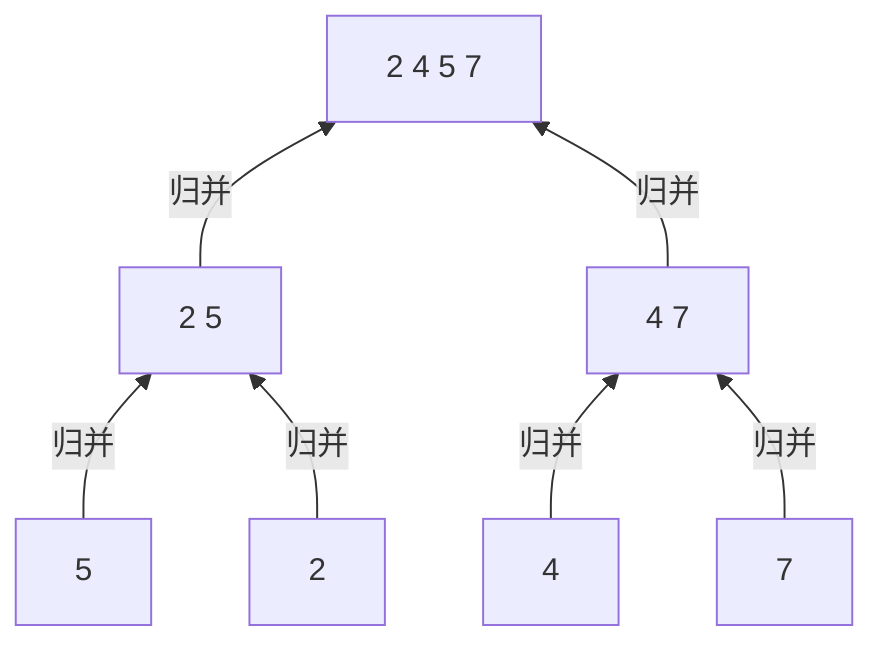

&emsp;&emsp;分治法是一种常见的算法设计思想。许多算法在结构上是递归的，这些算法采用的往往就是分治法。分治法的思想是将复杂问题分解为几个规模较小的但形式类似于原问题的子问题。递归地求解出子问题，再合并子问题的解，从而构建出原问题的解。

<!-- more -->

&emsp;&emsp;分治法在每层递归有三个步骤：

> 1. 分解原问题为若干子问题；
> 2. 解决子问题；
> 3. 合并子问题的解，建立原问题的解。

### 归并排序

&emsp;&emsp;其中一个典型的应用就是归并排序，上述三个步骤对应描述如下：

> 1. 分解：将待排序的n个元素分解为两个包含n/2元素的子序列；
> 2. 解决：使用归并排序递归地排序两个子序列；
> 3. 合并：合并两个已排序的子序列。

&emsp;&emsp;由于算法是递归的，所以可以预见到递归的末端所需处理的子序列长度均为1。此时对于这些子序列不需我们进行任何多余工作即自然地满足排序的要求。

&emsp;&emsp;分解工作完成后，下一步操作就需要解决问题。解决问题的操作是调用了一个MERGE的辅助过程。该过程对两个已排好序的子序列进行合并，产生一个新的顺序序列。

&emsp;&emsp;对于MERGE具体的思想是：重复比较两个子序列的首个元素，取其中最小的元素，将其添加到新产生的顺序序列中。直到一个子序列的所有元素都被添加到新序列中，此时可以确保另外一个非空的子序列均比已经处理的元素要大。因此我们可以直接将其合并。

```
// MERGE 伪代码描述
MERGE(A, p, q, r)
// 其中A是一个数组。A[p, q]和A[q + 1, r]是已经排序的两个子序列。
    n1 = q - p + 1                       // 序列1包含的元素数量
    n2 = r - q                           // 序列2包含的元素数量
    let L[1..n1+1] and R[1..n2+1] be new arrays
    for i = 1 to n1
        L[i] = A[p + i - 1]
    for j = 1 to n2
        R[j] = A[q + j]                  // 复制
    L[n1 + 1] = inf                      // 两个inf是标志算法可以停止的哨兵
    R[n2 + 1] = inf                      // 这里是为了简化代码实现
    i = 1
    j = 1
    for k = p to r                       // 假设j = n2+1，则L[i]均比R[j]小
        if L[i] <= R[j]                  // 比较首元素大小
            A[k] = L[i]
            i = i + 1
        else                             // 放置较小的那一个
            A[k] = R[j]
            j = j + 1
```

&emsp;&emsp;现在我们已经具备了完成该算法的所有条件了，让我们完成它。

```
MERGE-SORT(A, p, r)
// A[p, r]是一个数组，即待排序序列
    if p < r
        q = (p + r) / 2                  // 向下取整
        MERGE-SORT(A, p, q)
        MERGE-SORT(A, q+1, r)            // 分割原序列为两个序列
        MERGE(A, p, q, r)                // 合并两个已排序的子序列
```

&emsp;&emsp;值得注意的是，当A只含1项时该过程的行为。A.length = 1时，有p = r，不满足判断条件，即该过程什么都不做。两个长度为1的子序列MERGE成为一个长为2的新序列...

&emsp;&emsp;以此类推，自底向上，由小序列不断合成为新序列，最终完成原序列的排序工作。至此我们终于完成了归并排序的算法设计。



### 复杂度分析

&emsp;&emsp;我们知道归并排序最坏情况下的运行时间为`$\theta(nlgn)$`，而插入排序则为`$\theta(n^2)$`。显然归并排序在输入足够大的最坏情况下要快于插入排序。为什么？

&emsp;&emsp;分析程序运行步骤我们可以得到以下结论：

> 1. 分解：将原序列分解为两个子序列，耗费`$\theta(1)$`时间
> 2. 解决：递归地解决两个规模为n/2的子问题，耗费`$2T(n/2)$`时间
> 3. 合并：MERGE过程最多需要处理n个元素，因此耗费`$\theta(n)$`时间

&emsp;&emsp;因此我们获得了最坏情况下T(n)的递归式：

$$
T(n)=
\begin{cases}
\theta(1)&\text{若n=1}\\
2T(n/2)+\theta(n)&\text{若n>1}
\end{cases}
$$

&emsp;&emsp;为求解该表达式，我们需要引入一个定理。

> &emsp;&emsp;要求解`$T(n)=aT(n/b)+f(n)$`的渐进界，其中`$a\geq1,b>1$`为常数，`$f(n)$`为一个函数。
> 则有以下三种情况：
> 
> 1. 若对某个常数`$\epsilon>0$`有`$f(n)=O(n^{log_ba-\epsilon})$`，则`$T(n)=\theta(n^{log_ba})$`。
> 2. 若`$f(n)=\theta(n^{log_ba})$`，则`$T(n)=\theta(n^{log_ba}lgn)$`。
> 3. 若对某个常数`$\epsilon>0$`有`$f(n)=\Omega(n^{log_ba+\epsilon})$`，且对某个常数`$c<1$`和所有足够大的`$n$`有`$af(n/b)\leq cf(n)$`，则`$T(n)=\theta(f(n))$`。

&emsp;&emsp;对于归并排序算法，我们有`$a=2,b=2,f(n)=\theta(n)$`，则`$n^{log_ba}=n^{log_22}=n$`，两者大小相当，应用情况2。于是我们求得`$T(n)=\theta(nlgn)$`。

