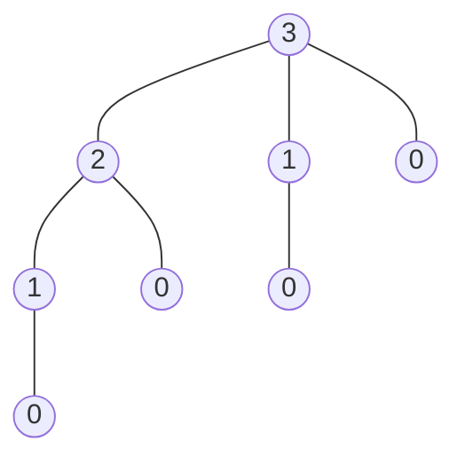

&emsp;&emsp;同[贪心算法](/posts/561198911/)一样，动态规划所要解决的问题通常也是最优解问题。在策略上，动态规划与[分治法](/2021/01/25/suan-fa-ji-chu-fen-zhi-fa/)相似，都是把复杂问题分解为数个子问题。不同的地方在于，分治法分解出的子问题均是独立的，即均需要进行单独的演算。而动态规划解决的是公共子问题，并将其保存以供重复利用，因此避免了大量不必要的计算工作。

<!-- more -->

&emsp;&emsp;一个动态规划算法的步骤大致有如下四步：

> 1. 刻画一个最优解的结构特征。
> 2. 递归地定义最优解的值。
> 3. 计算最优解的值，通常采用自底向上的方法。
> 4. 利用计算出的信息构造一个最优解。

### 钢条切割问题

&emsp;&emsp;对于给定的一段长为n英寸的钢条和一个价格表`$p_i$`（样例如下）。

| 长度`$i$`   | 1 | 2 | 3 | 4 | 5  | 6  | 7  | 8  | 9  | 10 |
|-------------|---|---|---|---|----|----|----|----|----|----|
| 价格`$P_i$` | 1 | 5 | 8 | 9 | 10 | 17 | 17 | 20 | 24 | 30 |

&emsp;&emsp;假设切割所需的成本为0，如何切割钢条可以使收益`$r_n$`最大化？

&emsp;&emsp;应用动态规划的思想，我们将原问题分解为一系列子问题。

#### 最优解的结构特征

&emsp;&emsp;对于一个钢条，我们总可以选择一个切割方案将钢条切成`$k$`段（`$k=1$`时表示不切割）如此一个最优解就应当是这种形式：

$$n=i_1+i_2+\cdots+i_n$$

&emsp;&emsp;从而获取最大收益`$r_n$`

$$r_n=p_{i_1}+p_{i_2}+\cdots+p_{i_n}$$

&emsp;&emsp;考虑`$n=1$`的情况，只能选择不切割的方案，此时获取收益为1。考虑`$n=2$`的情况，可以选择不切割或切割为两个长度为1的钢条，取收益较大者即可。而对于更普遍的情况，实际上我们总能用如下表达式表示最大收益。

$$r_n=max(p_n,r_1+r_{n-1},r_2+r_{n-2},\cdots,r_{n-1}+r_1)\tag{1}$$

> ~~这里应该可以省去一半的计算量~~

&emsp;&emsp;可以看出我们为了获取更普遍的情况，实际上是用子问题的最优解组合出最优解。因此我们说钢条切割问题具有**最优子结构性质**。


##### 注意与分治法的区别！
&emsp;&emsp;分治法不要求问题具有最优子结构性质，例如归并排序时我们只需要能够利用两子序列归并即可。但对于每一个子问题均是独立存在的，是需要单独计算的。而对于不具有最优子结构性质的问题，我们几乎就能断言其不适用动态规划了。


#### 递归地定义最优解的值

&emsp;&emsp;简化`$ (1)$`可以得到`$r_n=\max\limits_{1\leq i\leq n}(p_i+r_{n-i})$`。因此我们可以得到如下伪代码：

```
CUT-ROD(p, n)
// p为数组，即价格表；n为待处理钢条长度
    if(n == 0)                                 // 长度为0没有收益
        return 0
    q = -inf                                   // 初始化
    for i = 1 to n
        q = max(q, p[i] + CUT-ROD(p,n - i))
    return q
```

&emsp;&emsp;至此，这个算法确实可以计算出最优解。但由于其递归实现，其时间复杂度相当巨大。分析n=3的情况，可以得到如下递归树。



&emsp;&emsp;由递归树可知，对n个输入，对应结点数目为`$2^n$`个。其中有很多部分是重复的子问题，如果我们能够将其保存并加以利用，那么就可以降低算法的复杂度了。

> $$
> T(n) =
> \begin{cases}
> 1&\text{若n=0}\\
> \sum\limits_{j=0}^{n-1}T(j)&{其他}
> \end{cases}
> $$
>
> 可以证明`$T(n)=2^n$`，为一指数函数。实际上到这一步，对于分治法来说已经足够了，但对于动态规划还远远不够。

#### 计算最优解的值

&emsp;&emsp;由于递归版本的算法运行时间太长，实用性很低，因此有必要进行改进。改进的方法一般有两种，一是**带备忘的自顶向下法**，二是**自底向上法**。

##### 带备忘的自顶向下法

&emsp;&emsp;如字面意思，该版本的改进在于在递归过程中加入了对子问题最优解值的保存。在需要子问题的解的时候，程序首先检查是否保存了该解，从而省去了计算的时间。

```
// 带备忘的自顶向下法的伪代码描述
MEMOIZED-CUT-ROD(p, n)
// p为价格表，n为待处理钢条长度
    let r[0..n] be a new array
    for i = 0 to n
        r[i] = -inf                                              // 初始化备忘
    return MEMOIZED-CUT-ROD-AUX(p, n, r)

MEMOIZED-CUT-ROD-AUX(p, n, r)
    if r[n] >= 0
        return r[n]                                              // 存在备忘直接取出
    if n == 0
        q = 0
    else q = -inf
        for i = 0 to n
            q = max(q, p[i] + MEMOIZED-CUT-ROD-AUX(p, n-i ,r))
    r[n] = q                                                     // 保存备忘
    return q
```

##### 自底向上法

```
BOTTOM-UP-CUT-ROD(p, n)
    let r[0..n] be a new array
    r[0] = 0
    for j = 1 to n
        q = -inf
        for i = 1 to j
            q = max(q, p[i] + r[j-i])
        r[j]=q
    return r[n]
```
&emsp;&emsp;与自顶向下法比较，可以发现自底向上法最重要的地方三添加了第4行，以及将递归调用改为直接从r中取出。由于用取值代替了递归调用，算法自然不能像递归算法一样一层层继续下去，因此有必要添加自底向上的迭代方法。

&emsp;&emsp;容易得到该改进版本运行时间为`$\theta(n^2)$`，实际上MEMOIZED-CUT-ROD运行时间也是上式。

#### 利用计算出的信息构造一个最优解

&emsp;&emsp;到这一步我们已经计算得到了最大收益的值，但实际上对于钢条的切割方案并未提供最优解。这一步就是要保存每一段切割长度`$s_j$`。

```
EXTENDED-BOTTOM-UP-CUT-ROD(p, n)
    let r[0..n] and s[0..n] be new arrays                // r是备忘，s是最优解
    r[0] = 0
    for j = 1 to n
        q = -inf
        for i = 1 to j
            if q < p[i] + r[j-i]
                q = p[i] + r[j-i]
                s[j] = i
        r[j] = q
    return r and s
```

### 总结

&emsp;&emsp;要应用动态规划解决问题，问题需要具备以下两个性质：**最优子结构**和**子问题重叠**。

